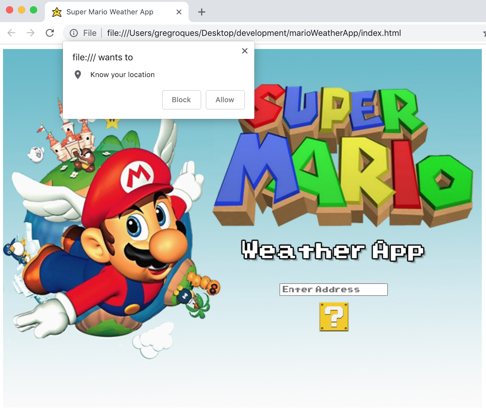
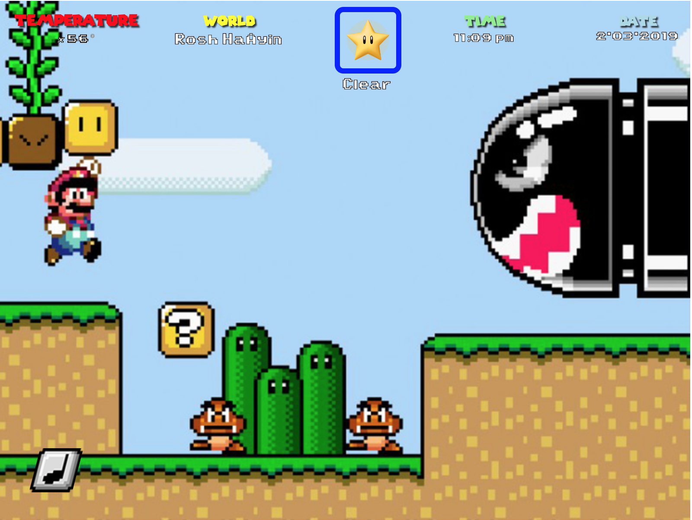
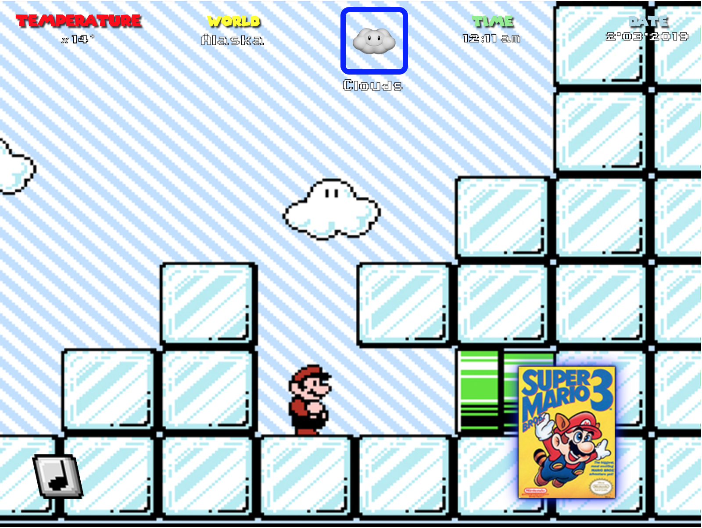

# Super Mario Weather App

## Contents
* Description
* Features
* Technologies
* Challenges and Solutions
* MVP
* Future Goals
* Author
* Screenshots


## Description
This project returns the time, date and current temperature and weather conditions for an input location with a fun theme from one of the many Super Mario games released before the turn of the century. Data is displayed in a format resembling the in-game player specs from *Super Mario World*, and the current weather icons are primarily taken from the *Super Mario Kart* series. Backgrounds are best on the current temperature: warmer degress will display warmer levels (the Desert World or a Lava Castle) and colder temperatures will result in colder worlds (ice world, etc.) Users have the option of importing their current location rather than typing in their location.

## Features
* Input your any location on Earth to return its current temperature, weather conditions, time and date. The date and time updates every minute a screen is open, and the weather conditions and temperature are updated every half-hour.
* Enjoy temperature specific backgrounds taken from the Super Mario series circa 1985 to 1996. Every 90 seconds, and image of the game the screen is taken from will appear in the bottom left hand corner – if the user clicks on this, a seperate window will open with a link to the game's wikipedia page.
* Looping game music from the background's stage; an icon in the bottom left hand corner gives users the ability to toggle the music on or off.


## Technologies
* HTML/CSS/JavaScript
* Open Weather Map API
* Google Places API

## Challenges and Solutions
**Translate Address to Latitude and Longitute:** The Open Weather MAP API only accepts latitude and longitude as coordinates to return weather conditions for a specified location. As this is not reasonable or convenient for the average user to have readily available, I used the Google Locations API to translate a typical address or location into lat/lng variables to be inserted into the Open Weather Map API Url.

```
// ================== Get Search Location Lat and Lon
const myLocation = $('.input-address').val();

    const myLocationComma = myLocation.replace(/,/g,"");
    const myLocFinalFormat = myLocationComma.replace(/ /g,"+")
    
    const addressToCordinatesUrl=`https://maps.googleapis.com/maps/api/geocode/json?address=${myLocFinalFormat}&key=${placesKey}`    
    
    let searchLat;
    let searchLon;
    let searchCoordinates;
    $.getJSON(addressToCordinatesUrl,(coridinateData)=>{   
        searchLat =  coridinateData.results[0].geometry.location.lat;
        searchLon =  coridinateData.results[0].geometry.location.lng;

    // ====================================== Build Open Weather Url with searchLat and searchLon
    
    
    function getWeather(){
        return `https://api.openweathermap.org/data/2.5/weather?lat=${searchLat}&lon=${searchLon}&appid=${apiKey}&units=imperial`;
    }
    setInterval("getWeather()",11800000)
    let weatherUrl = getWeather()
```
**Data Updates:** In the event that the user leaves their window open for an indeterminant ammount of time, I wanted the date and time to update by the minute, and the weather conditions and temperature to update every half hour. To achieve this, I used SetIntervals for every data function called.
```
// animate temp
    animateTemp(currTemp)
    setInterval("animateTemp(currTemp)",11800000)

    tempBackground(currTemp, specGame)
    setInterval("tempBackground(currTemp)",11800000)
    

    // animate world(city)
    animateWorld(`${weatherData.name}`)
    setInterval("animateWorld(`${weatherData.name}`)",11800000)
    

    // animate weather conditions
    animateWeather(currCondition,currDescription)
    setInterval("animateWeather(currCondition,currDescription)",11800000)
```
**Correct Time:** To ensure that the program displays the correct time and date for each location, I imported the daylight saving time offest and location offset from the Google Locations API by the searched location's timezone. I then applied these numbers to the current date and time of the users location to figure out the proper date and time for the searched location.
```
currDateAndTime = (new Date().valueOf())/1000

    dtURL =`https://maps.googleapis.com/maps/api/timezone/json?location=${searchLat},${searchLon}&timestamp=${currDateAndTime}&key=${timeZoneKey}`
    // console.log(dtURL)
    $.getJSON(dtURL,(dtData)=>{   
        const daylightOffset = dtData.dstOffset
        const locOffset = dtData.rawOffset
        // console.log(daylightOffset)
        // console.log(locOffset)
        offsetData =  (locOffset * 1000) + (daylightOffset * 1000)

        // animate Time
        animateTime(offsetData)
        setInterval("animateTime(offsetData)",1000)
        
        // animate Date
        animateDate(offsetData)
});    
});
```
```
    // ======================================================================================================= Show Time
    

    function animateTime(timeOffset){

        let timeNow = ((new Date().valueOf()) + timeOffset) + 18000000;
        let readableTimeNow = (new Date(timeNow));
        // console.log(readableTimeNow)
        let timeString = readableTimeNow.toTimeString().split(" ")
        let theTime = timeString[0].split(":")

        let hour = Number.parseInt(theTime[0]) 
        let min = theTime[1]
        let amPm 

        if (hour > 12){
            hour = hour -12
            amPm = "pm"
        } else {
            amPm = "am"
        }
        

        timeHTML=`
        <div class="timePosition">
             <div class="time">TIME</div>
             <div> <span class="time2">${hour}<b>:</b>${min}</span><span class="time3"> ${amPm}</span></div>
            
        </div>
        `
        $('.timeData').html(timeHTML);

    }
       // ==================================================================================================== Show Date
    
       function animateDate(dateOffset){

        let dateNow = ((new Date().valueOf()) + dateOffset) + 18000000;
        let readableDateNow = (new Date(dateNow));
        let dateString = readableDateNow.toDateString().split(" ")
        

        let monthStr = dateString[1];

        const monthNum = { Jan : 1, 
                        Feb : 2, 
                        Mar : 3, 
                        Apr :4 , 
                        May: 5, 
                        Jun : 6, 
                        Jul : 7, 
                        Aug : 8, 
                        Sep : 9, 
                        Oct : 10, 
                        Nov : 11, 
                        Dec: 12}
       
        let month = monthNum[monthStr]
        
        let day = dateString[2];
        let year = dateString[3];
           
           dateHTML=`
           <div class="datePosition">
               <div class="date">DATE</div>
               <div class="date2">${month}.${day}.${year}</div>
           </div>
           `
           $('.dateData').html(dateHTML);
               
       }
```

## MVP
Use Open Weather Map API to import the weather for a specific location.


## Future Goals
Make screen size responsive.

## Authors
- Greg Roques
    - [GitHub Profile](https://github.com/GregRoques)


## Screenshots





